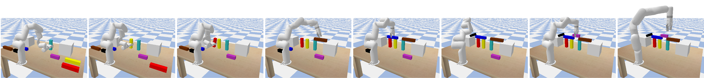

# Bridge Construction
Code for paper: Learning Design and Construction with Varying-Sized Materials via Prioritized Memory Resets.

## Installation
```
conda env create -f environment.yml
```

## Play with a trained model
Visualize a bridge designer trained with teleportation (objects are directly teleported to instructed poses, no robot motion involved):
```
CUDA_VISIBLE_DEVICES=-1 python run.py \
--env_id FetchBridgeBullet7Blocks-v1 --random_size --action_scale 0.6 --noop \
--algo ppg --policy_arch shared --inf_horizon --auxiliary_task inverse_dynamics --robot xarm \
--load_path models/trained_designer.pt --play
```
Visualize a model fine-tuned with a low-level motion generator:
```
CUDA_VISIBLE_DEVICES=-1 python run.py \
--env_id FetchBridgeBullet7Blocks-v1 --random_size --action_scale 0.6 --noop \
--algo ppg --policy_arch shared --inf_horizon --auxiliary_task inverse_dynamics --robot xarm \
--load_path models/finetuned.pt --play
```
You can add ``--primitive`` if you want to execute the design instructions with the motion generator. Otherwise, the objects will be directly teleported to the instructed pose.

## Train a model by yourself
Train a bridge design policy with prioritized memory reset (PMR) and auxiliary prediction task:
```
python run.py --env_id FetchBridgeBullet7Blocks-v1 --random_size --action_scale 0.6 --noop \
              --algo ppg --policy_arch shared --num_workers 64 --num_timesteps 2e7 \
              --noptepochs 10  --aux_freq 1 --inf_horizon \
              --restart_rate 0.5 --priority_type td --priority_decay 0.0 --filter_priority 0.9 --clip_priority \
              --auxiliary_task inverse_dynamics --force_scale 0 --robot xarm \
              --log_path <your/log/dir>
``` 
Fine-tune a pre-trained designer with a low-level motion generator:
```
python run.py --env_id FetchBridgeBullet7Blocks-v1 --random_size --action_scale 0.6 --noop \
              --algo ppg --policy_arch shared --num_workers 64 --num_timesteps 1e7 \
              --noptepochs 10 --aux_freq 1 --inf_horizon \
              --restart_rate 0.5 --priority_type td --priority_decay 0.0 --filter_priority 0.9 --clip_priority \
              --auxiliary_task inverse_dynamics --force_scale 10 --primitive --robot xarm \
              --load_path <path/to/your/pretrained/model>
```
